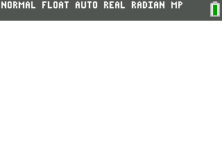

# CrossBun

CrossBun is a crossword puzzle program for the TI-84 Plus CE graphing calculator. It's heavily inspired by [Crosshare](https://crosshare.org/).

## Installation
To install, transfer `CROSSBUN.8xp` and [clibs.8xg from this repo](https://github.com/CE-Programming/libraries/releases/latest) to the calculator using TI-Connect CE or TiLP.
On newer calculators (OS 5.5 and above), you'll need to use [arTIfiCE](https://yvantt.github.io/arTIfiCE/) and optionally a shell like [Cesium](https://github.com/mateoconlechuga/cesium/releases) to run the program.

You'll also need to transfer at least one .8xv file containing crossword puzzles in order to use the program. These can be created from .puz files using the `convert.py` script.

## Usage
| Key (TI-84+CE) | Key (TI-83PCE) | Function                |
|----------------|----------------|-------------------------|
| Arrow keys     | Arrow keys     | Move cursor around      |
| 2nd            | 2nd            | Toggle cursor direction |
| A-Z (no alpha) | A-Z (no alpha) | Enter a letter          |
| del            | suppr          | Remove a letter         |
| Y=             | f(x)           | Skip to previous word   |
| graph          | graphe         | Skip to next word       |
| mode           | mode           | Exit without saving     |
| clear          | annul          | Save and exit           |
| vars           | var            | Switch clue font size   |

## Converter
This repository includes a script to convert multiple .puz files into a single crossword puzzle pack for the calculator to read.
To use it, you'll need to install the `convbin` utility (which is included with the [CE C toolchain](https://ce-programming.github.io/toolchain/index.html)).
You'll also need to install its dependencies, e.g. `pip install puzpy bitstring tivars`.
Then, you can run it like so: `python convert.py --title "My pack title" --description "Pack description input1.puz input2.put input3.puz MYPACK.8xv`.

## Limitations
- Does not support puzzles larger than 15x15
- Does not support rebus puzzles
- Only supports puzzles with empty initial state
- Only supports puzzles with alphabetical solutions and ASCII clues

## Building from source
Install the [CE C toolchain](https://ce-programming.github.io/toolchain/index.html).
Then, run `make`.
The compiled program will be located at `bin/CROSSBUN.8xp`.
